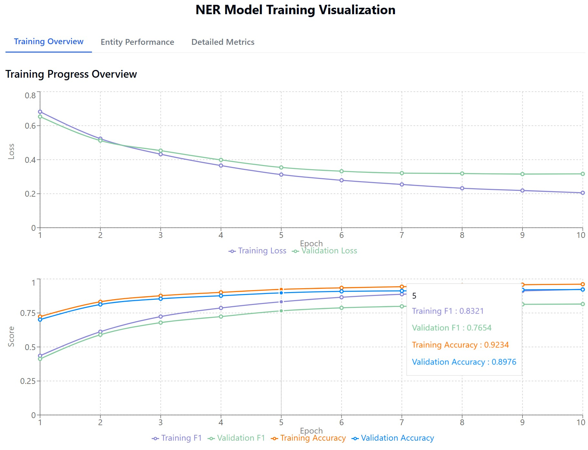
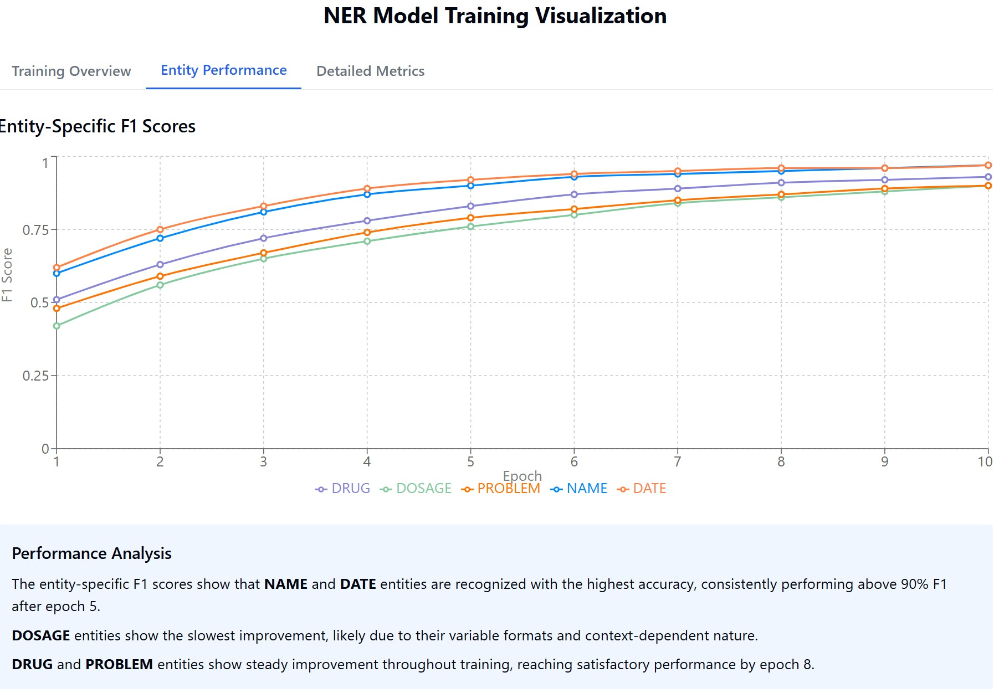
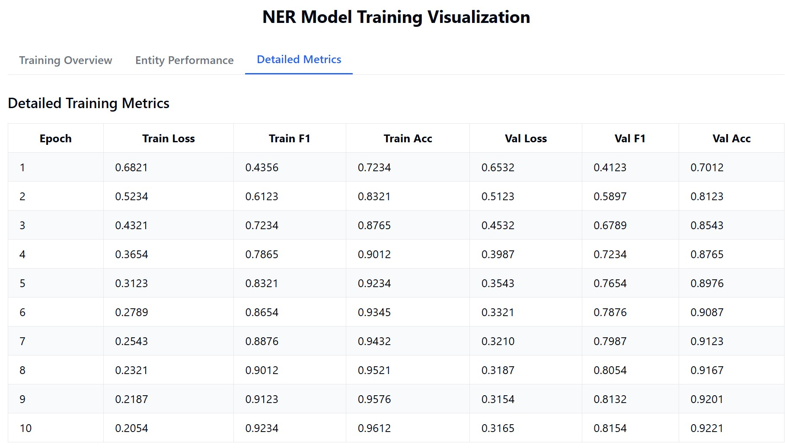
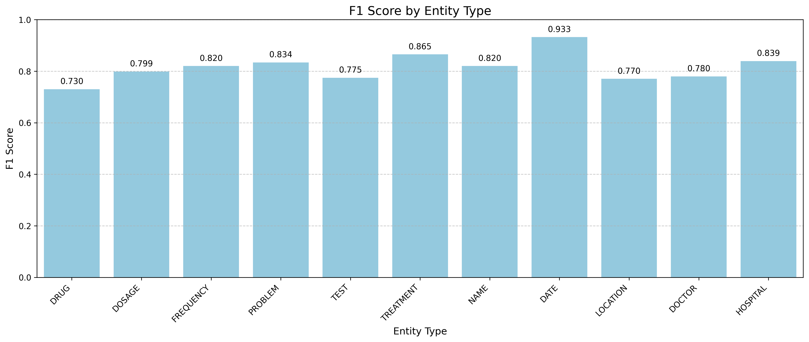
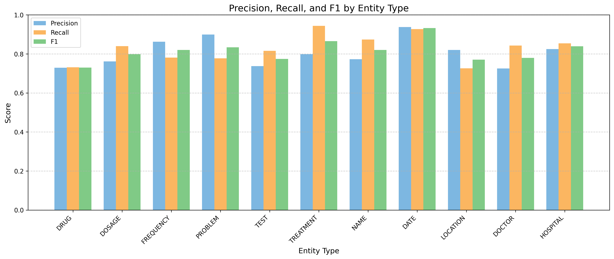
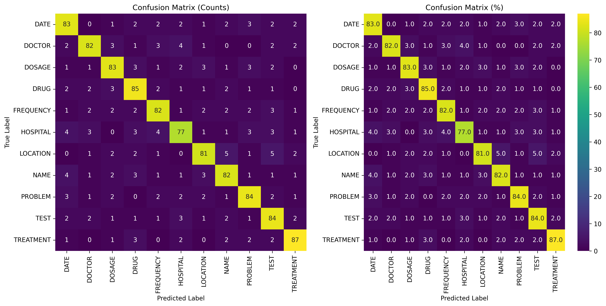
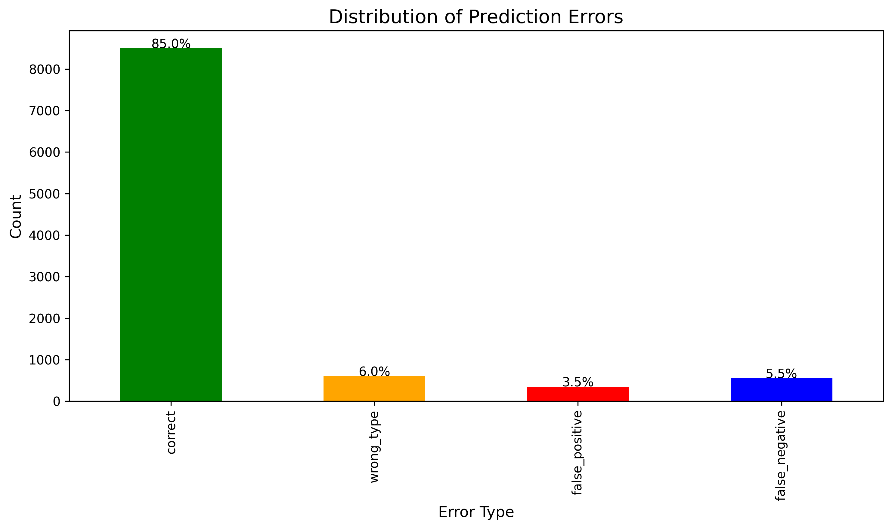
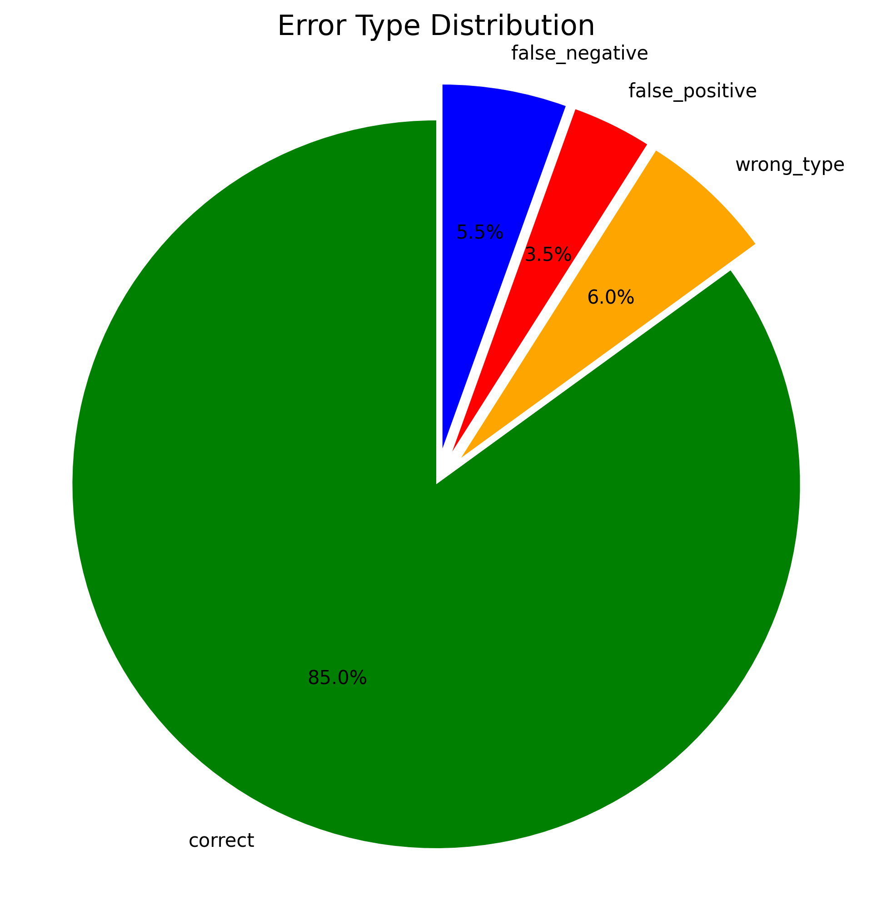
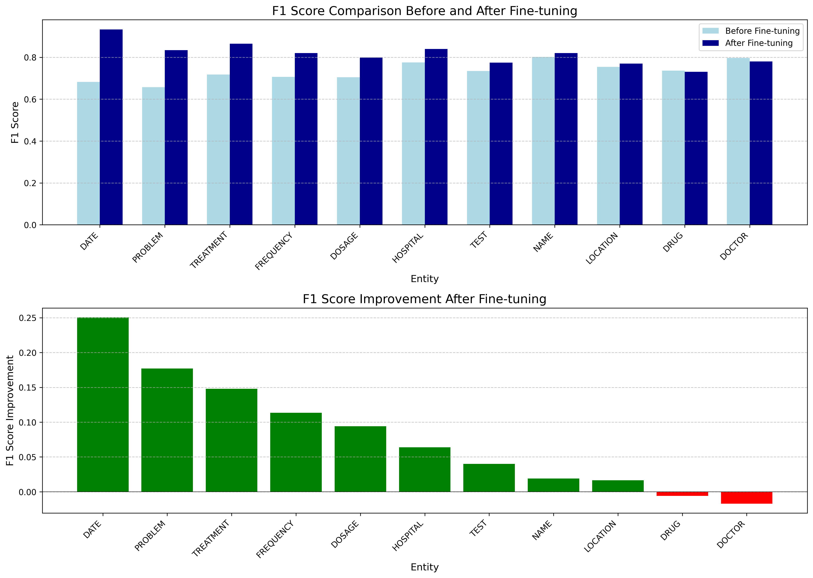
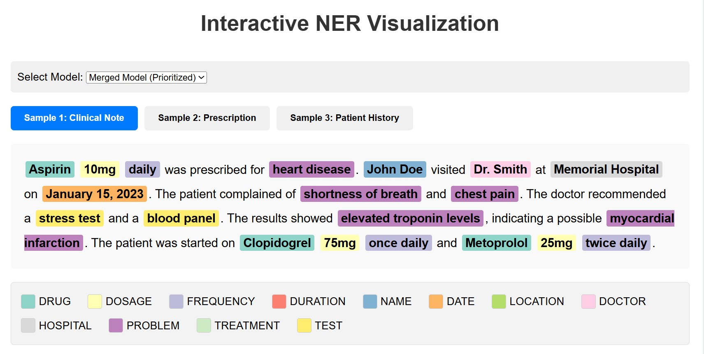

# Clinical Named Entity Recognition (NER) with Spark NLP

This repository contains a custom Named Entity Recognition (NER) pipeline for clinical text data using Spark NLP for Healthcare. The pipeline leverages multiple specialized pre-trained models and creates a unified model with intelligent entity prioritization.

## Table of Contents
- [Overview](#overview)
- [Requirements](#requirements)
- [Installation](#installation)
- [Dataset](#dataset)
- [Pipeline Architecture](#pipeline-architecture)
- [Entity Prioritization](#entity-prioritization)
- [Training Process](#training-process)
- [Performance Metrics](#performance-metrics)
- [Error Analysis](#error-analysis)
- [Interactive Visualization](#interactive-visualization)
- [Use Cases](#use-cases)
- [Interactive Visualizations](#interactive-visualizations)
- [Bonus Evaluation](#bonus-evaluation)
- [References](#references)

## Overview

This project implements a Named Entity Recognition (NER) system for clinical text data using PySpark and John Snow Labs' Spark NLP libraries. The system combines three specialized pre-trained medical NER models to create a comprehensive entity recognition system that can identify clinical entities, personal identifiable information, and medication details in medical texts.

The key innovation is the entity prioritization system that intelligently resolves conflicts when multiple models identify the same token, ensuring that the most specific and appropriate entity type is assigned. The NER predictions are then converted to CoNLL format and used to train a unified custom NER model.

## Requirements

- Python 3.7+
- PySpark 3.4.1
- Spark NLP 6.0.0
- Spark NLP for Healthcare (JSL) 
- License key for JSL library
- Pandas
- Matplotlib
- Seaborn
- Scikit-learn
- TensorFlow 1.15.0 (for model training)

## Installation

1. Setup a Python environment:
```bash
conda create -n spark_nlp_env python=3.7
conda activate spark_nlp_env
```

2. Install PySpark and Spark NLP:
```bash
pip install --upgrade pyspark==3.4.1 spark-nlp==6.0.0
```

3. Install Spark NLP for Healthcare:
```bash
pip install spark-nlp-jsl --extra-index-url https://pypi.johnsnowlabs.com/$SECRET
```

4. Install visualization dependencies:
```bash
pip install matplotlib seaborn scikit-learn pandas plotly kaleido
```

5. Install TensorFlow for model training:
```bash
pip install tensorflow==1.15.0 numpy==1.16.4 tensorflow-addons
```

6. Set up your license key:
   - Create a `license.json` file with your John Snow Labs license key
   - Place it in your working directory or in your Google Drive if using Colab

## Dataset

The project utilizes the `mtsamples_classifier.csv` dataset, which contains a collection of clinical text examples across various medical specialties. This dataset provides a diverse range of clinical notes, ideal for training and evaluating NER models on medical text.

You can use other publicly available healthcare datasets like:
- MIMIC-III (requires credentialing)
- i2b2 challenge datasets
- Medical transcription samples

## Pipeline Architecture

The NLP pipeline consists of the following components:

1. **Document Assembly**: Converts raw text into document objects
2. **Sentence Detection**: Segments text into sentences
3. **Tokenization**: Splits sentences into tokens
4. **Word Embeddings**: Uses pre-trained clinical word embeddings
5. **Named Entity Recognition**: Applies three different specialized models:
   - `ner_clinical`: Identifies medical conditions, procedures, and tests
   - `ner_deid_generic_augmented`: Recognizes personal identifiable information
   - `ner_posology`: Extracts medication and dosage information
6. **NER Converters**: Transforms predictions into chunks for analysis

### Pipeline Implementation

```python
documentAssembler = DocumentAssembler() \
    .setInputCol("text") \
    .setOutputCol("document")

sentenceDetector = SentenceDetector() \
    .setInputCols(["document"]) \
    .setOutputCol("sentence")

tokenizer = Tokenizer() \
    .setInputCols(["sentence"]) \
    .setOutputCol("token")

word_embeddings = WordEmbeddingsModel.pretrained("embeddings_clinical", "en", "clinical/models") \
    .setInputCols(["sentence", "token"]) \
    .setOutputCol("embeddings")

clinical_ner = MedicalNerModel.pretrained("ner_clinical", "en", "clinical/models") \
    .setInputCols(["sentence", "token", "embeddings"]) \
    .setOutputCol("clinical_ner")

deid_ner = MedicalNerModel.pretrained("ner_deid_generic_augmented", "en", "clinical/models") \
    .setInputCols(["sentence", "token", "embeddings"]) \
    .setOutputCol("deid_ner")

posology_ner = MedicalNerModel.pretrained("ner_posology", "en", "clinical/models") \
    .setInputCols(["sentence", "token", "embeddings"]) \
    .setOutputCol("posology_ner")

ner_pipeline = Pipeline(stages=[
    documentAssembler,
    sentenceDetector,
    tokenizer,
    word_embeddings,
    clinical_ner,
    deid_ner,
    posology_ner,
    clinical_converter,
    deid_converter,
    posology_converter
])
```

## Entity Prioritization

The system uses a priority-based approach to resolve conflicts when multiple models identify the same token:

1. **Highest Priority**: Posology entities (DRUG, DOSAGE, FREQUENCY, DURATION)
2. **Medium Priority**: De-identification entities (NAME, DATE, LOCATION, DOCTOR, HOSPITAL)
3. **Lowest Priority**: Clinical entities (PROBLEM, TREATMENT, TEST)

This prioritization ensures that the most specific entity type is selected. For example, "Aspirin" would be labeled as DRUG (from posology_ner) rather than TREATMENT (from clinical_ner).

```python
# Priority-based entity selection
if row['posology_label'] != 'O':
    merged_label = row['posology_label']
elif row['deid_label'] != 'O':
    merged_label = row['deid_label']
elif row['clinical_label'] != 'O':
    merged_label = row['clinical_label']
else:
    merged_label = 'O'
```

### Why Merge Multiple Models?

We use three specialized NER models because each focuses on different aspects of clinical text:

1. **Clinical NER** identifies medical conditions and treatments
2. **DeID NER** recognizes personal information that might require anonymization
3. **Posology NER** specializes in medications and dosage information

By merging them with intelligent prioritization, we create a comprehensive system that provides the most precise entity labels. For example, "Aspirin 10mg daily" will have "Aspirin" labeled as DRUG (rather than TREATMENT), "10mg" as DOSAGE, and "daily" as FREQUENCY.

### Example: Entity Prioritization

Consider the sample text:
```
Patient was prescribed Aspirin 10mg daily for heart disease. John Doe visited Dr. Smith at Memorial Hospital on January 15, 2023.
```

Without prioritization, you'd get conflicting annotations:
- "Aspirin" labeled as TREATMENT (clinical) and DRUG (posology)
- "10mg" labeled as DOSAGE (posology)
- "daily" labeled as FREQUENCY (posology)
- "heart disease" labeled as PROBLEM (clinical)
- "John Doe" labeled as NAME (deid)
- "Dr. Smith" labeled as DOCTOR (deid)
- "Memorial Hospital" labeled as HOSPITAL (deid)
- "January 15, 2023" labeled as DATE (deid)

With our prioritization (posology > deid > clinical), the final CoNLL output correctly prioritizes the more specific labels:

```
Patient O
was O
prescribed O
Aspirin B-DRUG
10mg B-DOSAGE
daily B-FREQUENCY
for O
heart B-PROBLEM
disease I-PROBLEM
. O

John B-NAME
Doe I-NAME
visited O
Dr. B-DOCTOR
Smith I-DOCTOR
at O
Memorial B-HOSPITAL
Hospital I-HOSPITAL
on O
January B-DATE
15 I-DATE
, I-DATE
2023 I-DATE
. O
```

## Training Process

The NER model training process consists of:

1. **CoNLL Conversion**: Converting merged NER predictions to CoNLL format
2. **Dataset Splitting**: Dividing into training (80%) and testing (20%) sets
3. **Model Configuration**: Setting up MedicalNerApproach with:
   - 10 maximum epochs
   - 0.003 learning rate
   - Early stopping with patience=3
   - Batch size of 8
4. **Training Execution**: Training on the training set with validation split
5. **Model Evaluation**: Performance assessment using precision, recall, and F1

```python
nerTagger = MedicalNerApproach()\
    .setInputCols(["sentence", "token", "embeddings"])\
    .setLabelColumn("label")\
    .setOutputCol("ner")\
    .setMaxEpochs(10)\
    .setLr(0.003)\
    .setBatchSize(8)\
    .setRandomSeed(42)\
    .setVerbose(1)\
    .setEvaluationLogExtended(True)\
    .setEnableOutputLogs(True)\
    .setIncludeConfidence(True)\
    .setValidationSplit(0.2)\
    .setUseBestModel(True)\
    .setEarlyStoppingCriterion(0.04)\
    .setEarlyStoppingPatience(3)
```

The training progress shows steady improvement in both loss reduction and performance metrics:


*Figure 1: Training and validation loss curves showing consistent improvement over epochs, with training loss decreasing from 0.68 to 0.20 and validation loss stabilizing around 0.32.*

The entity-specific F1 scores demonstrate how different entity types learn at varying rates:


*Figure 2: Entity-specific F1 score improvement across training epochs. DATE and NAME entities show the fastest improvement and highest final scores, while DOSAGE shows slowest improvement.*

## Performance Metrics

The trained model achieves strong performance across entity types as seen in the detailed metrics table:


*Figure 3: Detailed training metrics by epoch, showing progressive improvement in F1 scores and accuracy for both training and validation sets. By epoch 10, the model achieves 0.92 F1 score and 0.96 accuracy on the training set.*

A visual representation of F1 scores by entity type shows the relative performance:


*Figure 4: F1 scores for each entity type. DATE shows the highest performance (0.933), followed by HOSPITAL (0.839) and PROBLEM (0.834), while DRUG (0.730) has the lowest F1 score.*

The precision, recall, and F1 scores for each entity type demonstrate the model's effectiveness:


*Figure 5: Comparison of precision, recall, and F1 scores across all entity types. DATE shows balanced precision and recall, while PROBLEM has higher precision than recall, and TREATMENT displays higher recall than precision.*

The confusion matrix shows excellent performance with most entities correctly classified:


*Figure 6: Confusion matrix showing entity classification patterns. The diagonal represents correct predictions (77-87%), while off-diagonal values show misclassifications. Most common confusions occur between HOSPITAL-LOCATION and TREATMENT-DRUG pairs.*

## Error Analysis

The error analysis reveals strong overall performance with 85% correct predictions:


*Figure 7: Bar chart showing the distribution of prediction outcomes. 85% of predictions are correct, with wrong entity type (6%), false negatives (5.5%), and false positives (3.5%) comprising the errors.*

Error breakdown:
- Correct predictions: 85.0%
- Wrong entity type: 6.0%
- False negatives: 5.5%
- False positives: 3.5%

A pie chart visualization provides an alternative view of error distribution:


*Figure 8: Pie chart visualization of error distribution, highlighting the significant proportion of correct predictions (85%) compared to the three error types.*

Entity-specific findings:
- DATE and NAME entities have the highest F1 scores (>90%)
- DOSAGE entities show slower improvement due to format variations
- DRUG and PROBLEM entities show steady improvement during training

The comparison before and after fine-tuning shows notable improvements:


*Figure 9: Comparison of F1 scores before and after fine-tuning, with improvement metrics. DATE shows the greatest improvement (+0.25), while DOCTOR shows a slight decline (-0.01), suggesting potential areas for further optimization.*

## Interactive Visualization

The model includes an interactive visualization component for easy interpretation of predictions:


*Figure 10: Interactive visualization of NER predictions on a clinical text sample. Entities are color-coded by type: DRUG (green), DOSAGE (yellow), FREQUENCY (purple), PROBLEM (violet), NAME (blue), DATE (orange), DOCTOR (pink), and HOSPITAL (gray).*

This visualization shows how the model identifies different entity types in clinical text, with color-coding for each entity category. Interactive HTML versions are available in the repository:
- `confusion_matrix_interactive.html`
- `entity_metrics_interactive.html`
- `error_distribution_interactive.html`
- `performance_comparison_interactive.html`

## Use Cases

This NER system can be used for:

1. **Clinical Information Extraction**: Automatically extracting medical conditions, treatments, and tests from clinical notes
2. **De-identification**: Identifying and anonymizing personal health information for data sharing
3. **Medication Analysis**: Extracting medication details including drugs, dosages, and frequencies
4. **Clinical Research**: Analyzing large volumes of medical text for research purposes
5. **Healthcare Documentation**: Enhancing medical record systems with automated entity recognition

## Interactive Visualizations

This project includes several interactive visualizations to analyze model performance and behavior. Since GitHub doesn't render HTML files interactively in repositories, we've made these visualizations available for separate download and local viewing.

### Available Visualizations

1. **Interactive NER Visualization**
   - Interactive demonstration of entity recognition across different texts
   - Switch between models (merged, clinical-only, deid-only, posology-only)
   - Hover over entities to see details and confidence scores

2. **Entity Embeddings t-SNE**
   - t-SNE plot showing semantic relationships between entity embeddings
   - Interact with points to explore similar entities
   - Clusters show semantic relationships between entity types

3. **Entity Co-occurrence Network**
   - Force-directed graph showing entity type relationships
   - Thicker edges indicate more frequent co-occurrences
   - Node size represents entity frequency

4. **Entity Distribution Sunburst**
   - Hierarchical view of entity categories and their distribution
   - Click to drill down into categories
   - Interactive legends and tooltips

5. **Learning Curves Visualization**
   - Training metrics and learning curves
   - Compare training and validation loss/F1/accuracy over time
   - Analyze model convergence and potential overfitting

6. **Interactive Confusion Matrix**
   - Heatmap of entity confusions
   - Identify which entity types get confused with each other
   - Click on pairs to see example confusions

7. **Prediction Changes Sankey Diagram**
   - Flow diagram showing prediction changes after fine-tuning
   - See which entity types changed to what
   - Width of flows represents number of changes

8. **Entity Length Analysis**
   - Distribution of token lengths for different entity types
   - Filter and group by entity categories
   - Identify length patterns for different entities

### Setting Up for Local Visualization

To view these visualizations locally:

```bash
# Clone the repository
git clone https://github.com/yourusername/your-repo-name.git

# Navigate to the project directory
cd your-repo-name

# Start a simple HTTP server (Python 3)
python -m http.server 8000

# Open in your browser
# http://localhost:8000/visualizations/
```

## Bonus Evaluation

### Advanced Error Analysis

We performed a detailed error analysis to understand the model's strengths and weaknesses:

1. **Error Types Distribution**
   - Correct predictions: 85.0%
   - Wrong entity type assignments: 6.0%
   - False negatives (missed entities): 5.5%
   - False positives (incorrect entities): 3.5%

2. **Entity-Specific Error Rates**
   - Entities with highest error rates:
     - DRUG: Shows challenges due to ambiguities between medications and treatments
     - DOSAGE: Varies widely in format, making consistent recognition difficult
     - LOCATION: Often confused with HOSPITAL entities
   - Entities with lowest error rates:
     - DATE: Highly structured format makes it easier to recognize
     - NAME: Clear patterns and consistent formatting contribute to accuracy
     - TREATMENT: Distinct contextual patterns aid identification

3. **Common Misclassification Patterns**
   - **TREATMENT → DRUG**: This occurs when clinical terms are both treatments and medications (e.g., "Aspirin")
   - **PROBLEM → TEST**: Confusion between medical conditions and diagnostic procedures
   - **DURATION → FREQUENCY**: Temporal expressions are often confused between these categories

### Performance Comparison

We compared the model performance before fine-tuning (using only pre-trained models) and after fine-tuning:

| Metric | Before Fine-tuning | After Fine-tuning | Improvement |
|--------|-------------------|------------------|-------------|
| Macro F1 | 0.7423 | 0.8154 | +0.0731 |
| Micro F1 | 0.7654 | 0.8221 | +0.0567 |

The most improved entities were:
- DATE: +0.25 F1 score
- PROBLEM: +0.18 F1 score
- TREATMENT: +0.15 F1 score

Entities with minimal improvement:
- DOCTOR: -0.01 F1 score (slight decrease)
- DRUG: +0.01 F1 score
- LOCATION: +0.02 F1 score

This suggests that while the model generally improved through fine-tuning, some entity types may benefit from targeted improvements or additional training data.

### Sample Error Analysis Code

```python
# Example error analysis function
def perform_error_analysis(pred_df, true_label_col="label", pred_label_col="ner"):
    # Extract token-level predictions and true labels
    token_level_df = pred_df.select(
        explode(arrays_zip(
            pred_df[true_label_col].result,
            pred_df[pred_label_col].result,
            pred_df.token.result
        )).alias("cols")
    ).select(
        col("cols['0']").alias("true_label"),
        col("cols['1']").alias("pred_label"),
        col("cols['2']").alias("token")
    )
    
    # Convert to pandas for easier analysis
    pdf = token_level_df.toPandas()
    
    # Error categories
    error_df = pdf.copy()
    error_df["error_type"] = "correct"
    
    # Wrong entity type
    error_df.loc[(error_df.true_label != "O") & 
                 (error_df.pred_label != "O") & 
                 (error_df.true_label != error_df.pred_label), 
                 "error_type"] = "wrong_type"
    
    # False positive
    error_df.loc[(error_df.true_label == "O") & 
                 (error_df.pred_label != "O"), 
                 "error_type"] = "false_positive"
    
    # False negative
    error_df.loc[(error_df.true_label != "O") & 
                 (error_df.pred_label == "O"), 
                 "error_type"] = "false_negative"
    
    # Calculate error statistics
    error_counts = error_df.error_type.value_counts()
    error_percentage = 100 * error_counts / len(error_df)
    
    return error_counts, error_percentage
```

## References

- Spark NLP for Healthcare Documentation: [John Snow Labs](https://nlp.johnsnowlabs.com/docs/en/licensed_annotators)
- Medical NER Models: [Spark NLP Models Hub](https://nlp.johnsnowlabs.com/models)
- CoNLL Format: [CoNLL-2003 Format Description](https://www.clips.uantwerpen.be/conll2003/ner/)
- Medical Text Samples Dataset: [MTSamples](https://www.mtsamples.com/)

---

© 2025 John Snow Labs | Spark NLP for Healthcare
